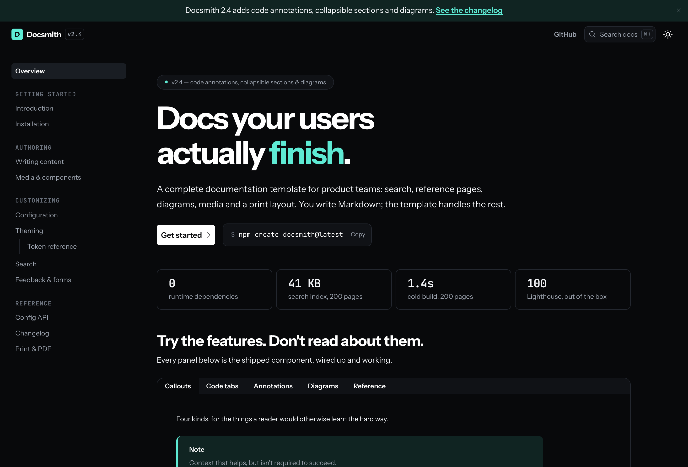
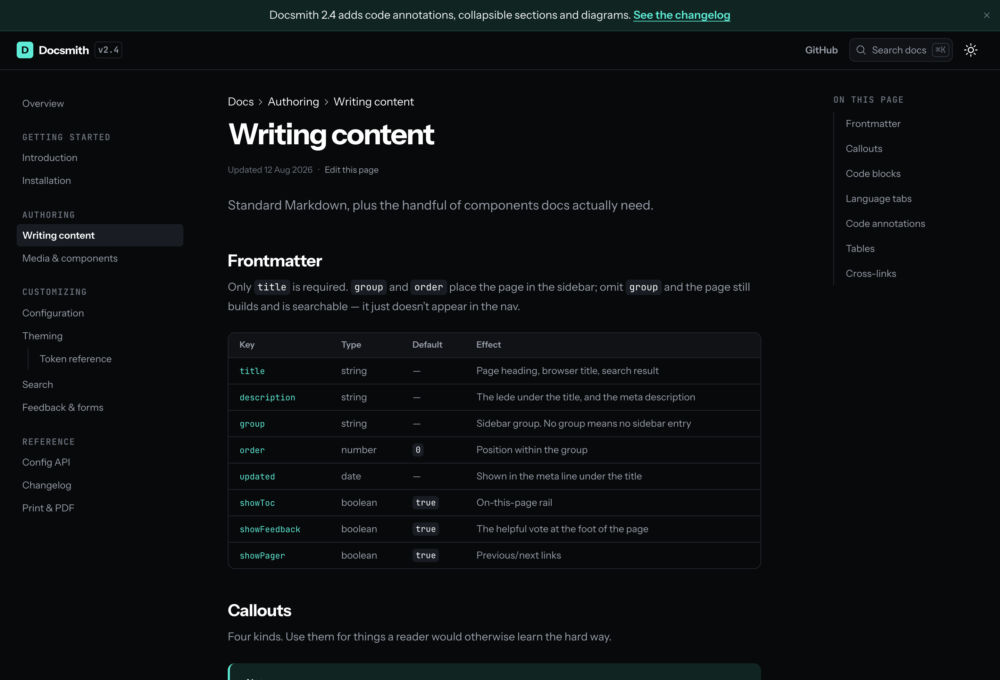

# Astro Documentation Starter

A complete documentation site built with Astro, designed for visual editing in
[CloudCannon](https://cloudcannon.com/). You clone it, you own it. Every component is your
source code to modify, extend, or delete.

You write Markdown; the template handles the grouped sidebar, client-side search, the
on-this-page rail, code tabs, diagrams, a print layout, and a 404 that searches. It ships dark
by default — `defaultTheme` in `src/data/docsSite.json` takes `dark`, `light` or `system`.



## Quick Start

```bash
npm ci
npm run dev
```

Your site is now running at `http://localhost:4321`.

**Make your first change:** open `src/content/docs/introduction.mdx`, edit a heading, and watch
it update in your browser.

**Then make it yours:**

```bash
npm run reset:starter
```

This asks for your site name and production URL, then clears out the demo documentation, the
overview page and the template's branding. It also sets `site` in `astro.config.mjs`, which
every canonical URL, sitemap entry and JSON-LD record is built from. Left at its placeholder,
all of them point at a domain you don't own, and nothing errors — `npm run check` warns until
it's set.

## What You'll See

The demo content is the template documenting itself: every feature is demonstrated by a page
that uses it, so there is nothing to read that you can't also click.

| Page                     | Demonstrates                                                    |
| ------------------------ | --------------------------------------------------------------- |
| `/`                      | The page builder — hero, stats, card grid, feature grid, CTA    |
| `/writing-content/`      | Callouts, fences, language tabs, annotated code, tables         |
| `/media-and-components/` | Disclosures, definition lists, Mermaid diagrams, figures, video |
| `/config-api/`           | Parameter lists for reference pages                             |
| `/changelog/`            | Tagged release entries                                          |
| `/print-and-pdf/`        | The print layout (try ⌘P)                                       |

## How a Page Works

A documentation page is one `.mdx` file. Its path is its URL, and its frontmatter places it in
the sidebar:

````mdx
---
title: Webhooks
description: Receive events as they happen.
group: Guides
order: 2
---

## Retries

<Alert
  variant="warning"
  title="Rotating a key revokes the old one"
  text="Deploy the new key first."
/>

```js title="webhook.js" {2}
export default {
  retries: 5,
};
```
````

```

**The sidebar is derived, not configured.** `group` and `order` place a page; a page with no
`group` still builds and is searchable, it just has no sidebar entry.
`src/data/docsSite.json` only orders the groups — and an editor changes it in CloudCannon, not
in a pull request.

## Why This Starter

- **Components are born CMS-editable.** Every component ships its editor schema beside it.
  There's no second project to "make it editable" — add a component and it appears in the
  editor's Add menu with a preview, and in the Content Editor's insert menu if it has a snippet.
- **Design lives in tokens, not components.** The same components render as any brand by
  swapping token files. No component CSS to fight.
- **It's built to be operated by AI.** Ten skills in `.agents/skills/` encode the workflows —
  write a page, create a component, turn a screenshot into one, migrate an existing site,
  retheme — as playbooks your coding agent can follow. The component catalog they read is
  generated from the components themselves, so it can't rot behind a rename.
- **The output is boring, excellent Astro.** Static, no runtime, tiny JS payload, inlined CSS.
  The only heavy dependency is Mermaid, and it loads only on pages that contain a diagram.

## Components

68 page-builder components — 12 page sections, 53 building blocks and 3 navigation blocks —
plus 8 pieces of site chrome (topbar, sidebar, table of contents, search, pager, feedback,
theme toggle, heading links) and 343 icons. Thumbnails for every one are in
`public/component-previews/`; `npm run previews:montage` renders them as a single contact sheet.



The catalog — every component, when to use it, and its props — is
[`.agents/skills/page-content-authoring/component-catalog.md`](.agents/skills/page-content-authoring/component-catalog.md).

## The Three-File Pattern

Every component ships with three files. This is what makes the system work: developers build
components, editors visually manage content.

```

src/components/.../button/
├── Button.astro # The component
├── button.cloudcannon.inputs.yml # What editors see and can change
└── button.cloudcannon.structure-value.yml # Defaults and picker metadata

````

A fourth, `button.cloudcannon.snippets.yml`, adds it to the Content Editor's insert menu for
documentation pages.

Scaffold them, wired up correctly:

```bash
npm run new:component building-blocks/core-elements/my-thing
````

## Key Directories

```
src/
├── components/
│   ├── building-blocks/ # Core UI: callouts, code blocks, diagrams, forms, layout wrappers
│   ├── page-sections/   # Full-width sections: heroes, stats, features, CTAs
│   └── navigation/      # Topbar, sidebar, table of contents, search, pager, feedback
├── content/
│   ├── docs/            # Documentation pages (.mdx) — the sidebar is built from these
│   └── pages/           # Page-builder pages (.md) — the overview page
├── data/                # Header, footer, SEO, announcement bar (editable in the CMS)
├── layouts/             # Docs.astro (the shell) and BaseLayout.astro (the document)
├── styles/
│   ├── variables/       # Primitive tokens: colors, fonts, spacing, radius
│   ├── themes/          # Light and dark semantic tokens
│   └── base/            # Prose, print, typography, tables
└── utils/               # docsNav.ts — the sidebar, pager and breadcrumb derivation
```

## Making It Your Brand

Rebranding is a token change, not a redesign:

- **Colors, spacing, radius, shadows, type scale** — `src/styles/variables/`
- **Light and dark semantics** — `src/styles/themes/_light.css` and `_dark.css`
- **Which one a first-time reader sees** — `defaultTheme` in `src/data/docsSite.json`
- **Fonts** — `site-fonts.mjs`, the single source of truth
- **Header, footer, SEO defaults** — `src/data/*.json`

The accent (`--color-accent`) is deliberately not the button colour: links, the active sidebar
item, focus rings and code annotations use it, while primary buttons stay ink on paper. Change
it and the page doesn't become a wall of one hue.

`npm run lint:css-vars` fails the build on any `var(--x)` that doesn't resolve, which catches
the silent-failure class of theming bug — an unresolved custom property is invalid at
computed-value time, so the declaration just inherits with no error anywhere. Run
`npm run lint:css-vars -- --list` to print every token that exists.

## Commands

| Command                 | Description                                                |
| ----------------------- | ---------------------------------------------------------- |
| `npm run dev`           | Start the development server                               |
| `npm run build`         | Build for production and index it for search               |
| `npm run search:dev`    | Build a search index you can use locally                   |
| `npm run check`         | The full gate — lint, format, types, and every drift check |
| `npm run check:fix`     | Auto-fix lint and formatting                               |
| `npm run new:component` | Scaffold a component and its CloudCannon schema            |
| `npm run docs:catalog`  | Regenerate the agent-facing component catalog              |
| `npm run reset:starter` | Clear the demo content and set your site name and URL      |
| `npm run test:unit`     | Unit tests (Vitest)                                        |
| `npm run test:render`   | Verify every component's defaults build                    |
| `npm run test:smoke`    | Headless-browser checks against the built site             |

Run `npm run check` before you commit — it's what CI runs, and it catches schema drift between
a component and its editor config, plus dead internal links, which nothing else will.

The smoke tests need the component harness routes:

```bash
COMPONENT_PREVIEWS=true npm run build && npm run test:smoke
```

## Deploying

See **[docs/DEPLOYMENT.md](docs/DEPLOYMENT.md)**. The repository ships CloudCannon's build
settings, so connecting it is a few clicks — and component schemas are picked up automatically.

## Prerequisites

- **Node.js 22.12 or later.** The repo pins `24.18.0` in `.nvmrc`, which is the version CI uses.

## Updating Dependencies

When adding, removing, or updating packages (on macOS especially), use:

```bash
npm run deps:sync
```

This regenerates `package-lock.json` with resolutions for all target platforms (Linux, Windows,
macOS) so CI doesn't break. Plain `npm install` on macOS silently strips Linux-only peer
dependencies out of the lockfile, which causes `npm ci` to fail on GitHub Actions.

Verify the lockfile is CI-ready at any time with `npm run deps:check`.

## Learn More

- **[docs/ARCHITECTURE.md](docs/ARCHITECTURE.md)** — how content becomes HTML, the component
  registry, the documentation shell, and the patterns not to refactor.
- **[docs/DEPLOYMENT.md](docs/DEPLOYMENT.md)** — deploying to CloudCannon.
- **[CONTRIBUTING.md](CONTRIBUTING.md)** — adding a component and the checks it has to pass.
- **`.agents/skills/`** — the workflow playbooks, for you or your coding agent.

## License

[MIT](LICENSE)
